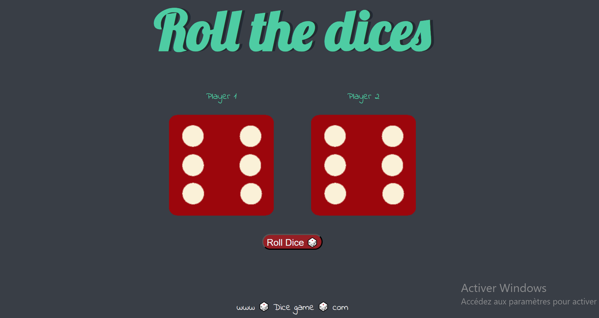

# 🎲 Dice Challenge

A simple and interactive dice game built with **HTML**, **CSS**, and **JavaScript**.

Each time the player rolls the dice, two random dice values are generated. The game automatically updates the dice images and displays the winner or a draw.

---

## 🚀 Features

- 🎲 Random dice generation
- 🖼️ Dynamic dice image updates
- 🏆 Automatic winner detection
- 🤝 Draw detection
- 🎨 Responsive and clean UI
- 📱 Built with vanilla JavaScript (no frameworks)

---

## 🛠️ Technologies

- HTML5
- CSS3
- JavaScript (ES6)

---

## 📸 Preview



---

## 📂 Project Structure

```
Dice-Challenge/
│
├── images/
│   ├── dice1.png
│   ├── dice2.png
│   ├── dice3.png
│   ├── dice4.png
│   ├── dice5.png
│   ├── dice6.png
│
├── dice.html
├── dice.css
├── dice.js
└── README.md
```

---

## 🎮 How to Play

1. Open the project in your browser.
2. Click the **Roll Dice** button.
3. Two random dice are generated.
4. The game announces:
   - 🚩 Player 1 Wins!
   - 🚩 Player 2 Wins!
   - 🤝 Draw!

---

## 💡 What I Learned

During this project I practiced:

- DOM manipulation
- Event handling
- Random number generation
- Conditional statements
- Updating HTML elements dynamically
- JavaScript functions
- Working with images using JavaScript


Follow my journey as a programmer.

GitHub: **Wayne-developper**
